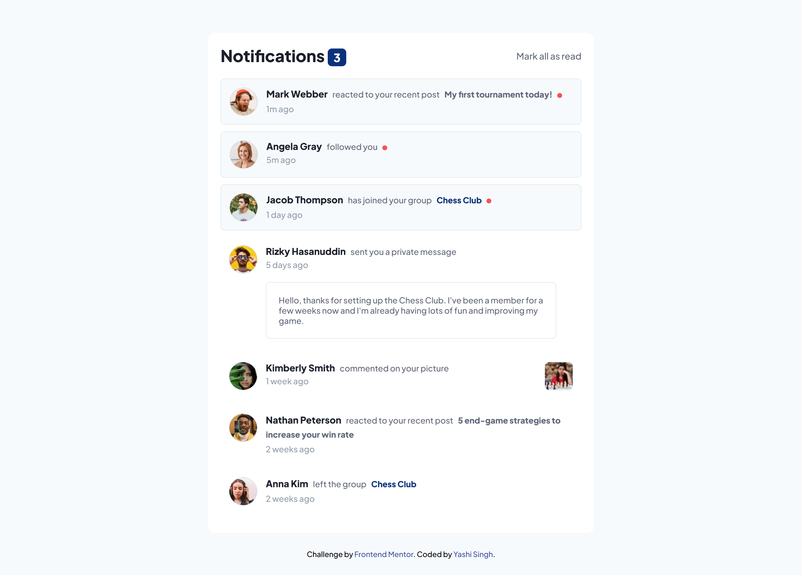
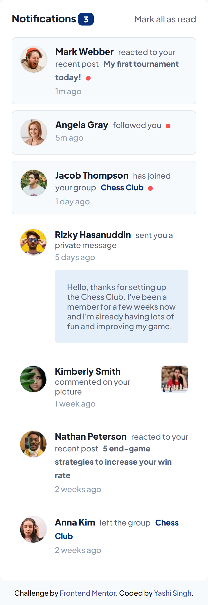

# Frontend Mentor - Notifications Page Solution

This is a solution to the [Notifications page challenge on Frontend Mentor](https://www.frontendmentor.io/challenges/notifications-page-DqK5QAmKbC). Frontend Mentor challenges help you improve your coding skills by building realistic projects. 

## Table of contents

- [Overview](#overview)
  - [The challenge](#the-challenge)
  - [Screenshot](#screenshot)
  - [Links](#links)
- [My process](#my-process)
  - [Built with](#built-with)
  - [What I learned](#what-i-learned)
  - [Continued development](#continued-development)
  - [Useful resources](#useful-resources)
- [Installation and Setup](#installation-and-setup)
- [Author](#author)
- [Acknowledgments](#acknowledgments)

## Overview

### The challenge

Users should be able to:

- Distinguish between "unread" and "read" notifications
- Select "Mark all as read" to toggle the visual state of the unread notifications and set the number of unread messages to zero
- View the optimal layout for the interface depending on their device's screen size
- See hover and focus states for all interactive elements on the page

### Screenshot

**Desktop Desing**



**Mobile Design**



### Links

- Solution URL: [Solution](https://your-solution-url.com)
- Live Site URL: [Live Site](https://your-live-site-url.com)

## My process

### Built with

- Semantic HTML5 markup
- CSS custom properties
- Flexbox
- LESS preprocessor
- Mobile-first workflow
- JavaScript for interactivity

### What I learned

This project reinforced my understanding of LESS preprocessing and modularizing CSS for reusability. Here are some highlights of what I learned:

- **Dynamic Styling Using LESS Variables**  
  Using variables in LESS helped me manage the theme colors across the project easily.

  ```less
  @blue: hsl(219, 85%, 26%);
  @very-light-grayish-blue: hsl(210, 60%, 98%);
  ```

- **Dynamic Class Toggling in JavaScript**  
  I used JavaScript to manage the "unread" and "read" states for the notifications dynamically. Below is a code snippet of marking all notifications as read:

  ```js
  markAllReadButton.addEventListener("click", () => {
    unreadNotifications.forEach((notification) => {
      notification.classList.remove("unread");
      const icon = notification.querySelector("i.fa-circle");
      if (icon) {
        icon.style.display = "none";
      }
    });
    updateUnreadCount();
  });
  ```

### Continued development

In future projects, I aim to:

- Explore more CSS preprocessors like SCSS and compare them with LESS for larger projects.
- Improve accessibility features like ARIA roles to enhance user experience for screen readers.

### Useful resources

- [LESS Documentation](https://lesscss.org/) - Helped me understand how to use variables, nesting, and other features.
- [MDN Web Docs - querySelector](https://developer.mozilla.org/en-US/docs/Web/API/Document/querySelector) - A great resource for DOM manipulation.

## Installation and Setup

### Prerequisites
Make sure you have the following installed on your system:
- [Node.js](https://nodejs.org/en/) and npm
- A code editor like [VS Code](https://code.visualstudio.com/)

### Installation

1. Clone this repository:
   ```bash
   git clone https://github.com/Yashi-Singh-9/notifications-page.git
   cd notifications-page
   ```

2. Install dependencies (if applicable):
   ```bash
   npm install
   ```

3. Compile LESS to CSS:
   If you don’t have the LESS compiler installed globally, install it first:
   ```bash
   npm install -g less
   ```
   Then compile the LESS file:
   ```bash
   lessc style.less style.css
   ```

4. Open `index.html` in your browser:
   You can use the Live Server extension in VS Code or simply open the file in your browser to see the page.

## Author

- LinkedIn - [Yashi Singh](https://www.linkedin.com/in/yashi-singh-b4143a246)
- Frontend Mentor - [Yashi-Singh-9](https://www.frontendmentor.io/profile/Yashi-Singh-9)

## Acknowledgments

Special thanks to Frontend Mentor for the well-designed challenges that help me improve my development skills.